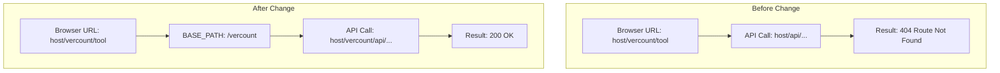

# GS-VerCount - Replication Verification and Scheduling Tool

GS-VerCount is a specialized, lightweight monitoring utility designed to reconcile records between your source (AS400) and target (MSSQL) databases managed by GlueSync.

## Features

- **🔍 Verification Tool:** Perform on-demand reconciliation of table rows between AS400 and MSSQL.
- **📜 Report History:** Save, list, search, filter, and delete detailed HTML verification reports.
- **⚙️ Scheduler Settings:** Define report profiles, mailer profiles, and scheduled jobs (via Cron expression presets) to automate reconciliation checks and email report summaries.

## Getting Started

### Prerequisites

- **Podman** / **Docker** and **Compose** installed. (The necessary `qadmcli` libraries and JDBC drivers are bundled directly inside the project).

### Environment Setup

Create a `.env` file inside this directory or make sure it has been copied from `replica-mon`:

```bash
# GlueSync Core Hub Credentials
GLUESYNC_HOST=https://localhost:1717
GLUESYNC_ADMIN_USERNAME=admin
GLUESYNC_ADMIN_PASSWORD=your_password

# AS400 Source Credentials
AS400_HOST=your_as400_host
AS400_USER=your_as400_user
AS400_PASSWORD=your_as400_password

# MSSQL Target Credentials
MSSQL_HOST=your_mssql_host
MSSQL_DATABASE=your_mssql_db
MSSQL_USER=your_mssql_user
MSSQL_PASSWORD=your_mssql_password

# External URL for emails & reports (defaults to http://{HOST_IP}:8083)
# To access directly using host's LAN IP:
APP_EXTERNAL_URL=http://{HOST_IP}:8083
# Or when running behind the Traefik reverse proxy:
# APP_EXTERNAL_URL=http://{HOST_IP}:8085/vercount
```

### Build & Deploy

Run the build-run script to compile and start the container service:

```bash
./build-run.sh
```

This will:
1. Build the `localhost/gs-vercount` container image.
2. Launch the container service in detached mode via `podman-compose`.
3. Start the FastAPI backend and Scheduler daemon on port **8083**.

### Usage

1. Open your web browser and navigate to `http://localhost:8083`.
2. Select a pipeline and click **Run Verification** to execute counts.
3. Click **Save to History** to archive the report.
4. Navigate to the **Report History** tab to view, search, or delete reports.
5. Click the **Gear icon** to set up scheduled checks (jobs, report profiles, and email profiles).

## Proxy & Subpath Deployment

When deployed behind a reverse proxy (e.g. Traefik) under a custom subpath prefix (like `/vercount`), the frontend dynamically detects the base path from `window.location.pathname` to ensure that API and WebSocket connections route correctly without hardcoding:



The base path resolution evaluates:
* `BASE_PATH`: Extracts any preceding path prefix, stripping routing keywords like `/tool` or trailing slashes.
* `API_HOST`: Resolves to `${location.protocol}//${location.host}${BASE_PATH}`.
* `WS_HOST`: Resolves to the correct secure (`wss:`) or unsecure (`ws:`) protocol prefix + `${location.host}${BASE_PATH}`.

This makes the application completely subpath-aware out-of-the-box and fully backward-compatible with root level deployments (where `BASE_PATH` resolves to `""`).
